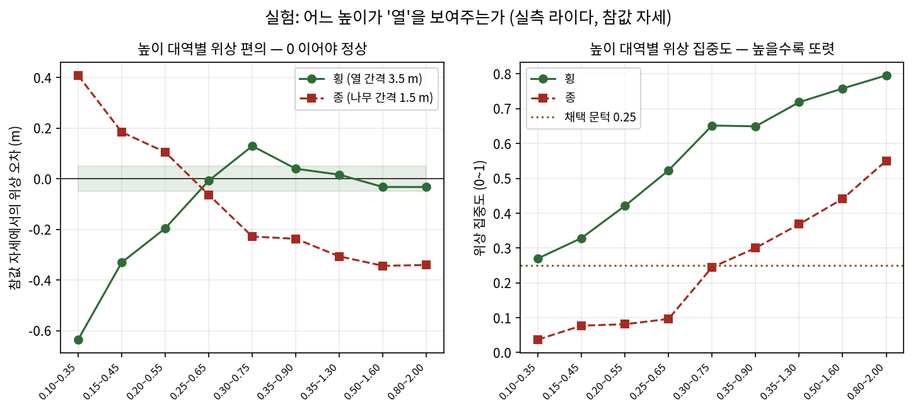
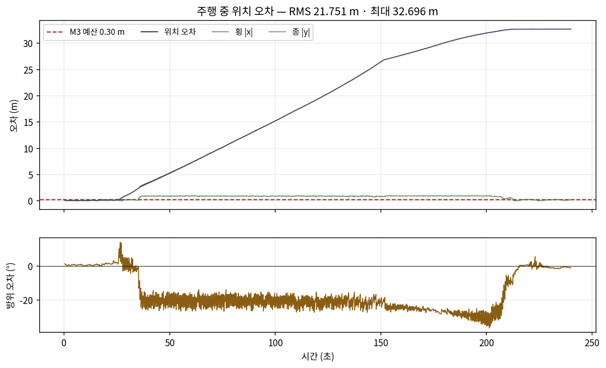
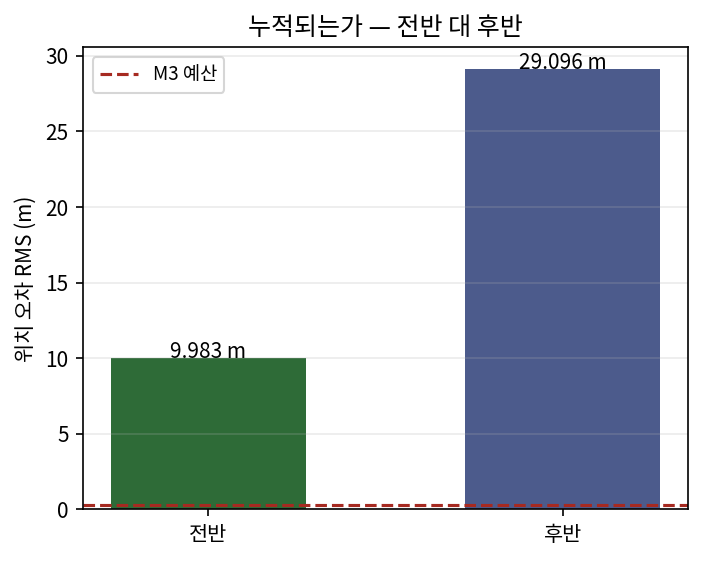
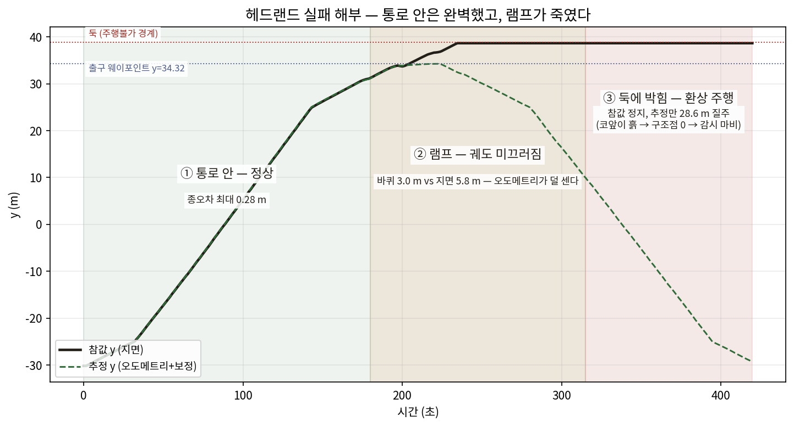

# M3 사전 맵 로컬리제이션 — 실험 기록과 배운 것

| 항목 | 내용 |
|---|---|
| 기간 | 2026-08-01 ~ 08-02 |
| 목적 | "사전 맵을 쓰면 오차가 누적되지 않는다"는 설계 가설의 검증 |
| 상태 | 통로 안 로컬리제이션 검증 완료 · **선회 이후 실패** (원인 규명 완료) |
| 코드 | `rowlocalize.py` `mapbundle.py` `map_localizer.py` · 검증 `scripts/37~41` |

---

## 0. 왜 이 실험을 했나

스타트업 때 풀지 못한 문제가 있다. **주행하면서 지도를 만드는 방식(LIO)이 선회부에서 무너진다.** Livox MID-70은 원형 시야 ±35.2°의 전방만 본다. 통로 안에서는 양옆 나무가 보여 횡방향·방위가 잡히지만, 통로 끝에서 선회하면 나무가 시야에서 사라지고 지면만 남는다. 지면은 높이·기울기만 알려줄 뿐 "내가 옆으로 얼마나 밀렸는지"는 말해주지 않는다. 그 순간 제약이 사라지고 오차가 **누적**된다.

측정으로 확인한 사실이다: 선회 진입 시 구조점이 68%로 떨어지고 측방 퍼짐이 28 m → 11.2 m로 줄었다. 파라미터 조정 17회, 선회 감속, 랜드마크 397개 추가, 휠 오도메트리 융합 3종, 중력 기반 자세 보정 — **여덟 가지 대책이 전부 실패**했다.

그래서 설계를 바꿨다. 맵을 미리 만들어 두고, 주행 중에는 **그 맵에 자기를 맞추기만 한다**. 맵이 절대 기준을 주므로 오차가 쌓일 자리가 없다. 이 문서는 그 가설이 실제로 성립하는지 확인한 기록이다.

---

## 1. 맵 번들 — 만드는 일과 쓰는 일을 파일로 가른다

맵을 만드는 일(느리고 한 번)과 쓰는 일(빠르고 매번)을 파일 경계로 갈랐다.

| 파일 | 내용 | 누가 쓰나 |
|---|---|---|
| `cloud.npz` | 정합 기준 점군 | 로컬리제이션 |
| `trav.npz` | 주행가능 격자 + 원점·해상도 | 주행경계 판정(S9) |
| `graph.json` | 통로 중심선·연결 | 경로 생성 |
| `meta.yaml` | 기하 + **버전 해시** | 임무 계약 |

**버전 해시가 핵심이다.** 서버가 v2 그래프로 만든 임무를 로봇이 v1 지형에서 실행하면 계단식 밭에서는 그대로 사고다. 로봇은 해시가 다르면 임무를 거부한다.

### 여기서 배운 것 둘

**통로가 10개 나왔다** (기대 9). 바깥 열 너머의 여백 띠도 길고 곧아서 중심선이 잡힌 것이다. 기대 개수를 하드코딩해 자르고 싶은 유혹이 있었지만, 그러면 밭 모양이 바뀔 때 조용히 깨진다. **"양옆이 나무 열로 둘러싸였는가"** 라는 기하 판정으로 걸렀다 — 열 간격이 달라져도 성립한다.

**중심선 오차가 211 mm였다.** 추적된 중심선의 양 끝이 선회 구역으로 휘어 들어가는 부분까지 포함돼 있었다. 직선 구간만 통로로 보고 굽은 부분은 경로 계획에 맡기도록 잘라내니 **58 mm**(최대 100 mm = 격자 한 칸)로 떨어졌다.

> **교훈** — 정확도가 나쁘게 나올 때, 알고리즘을 고치기 전에 "무엇을 재고 있는지"를 먼저 의심할 것. 이번엔 대상 정의가 틀렸지 계산이 틀린 게 아니었다.

---

## 2. 과수원은 주기 구조다 — 방향마다 성질이 다르다

여기가 이번 작업에서 가장 중요한 발견이다.

과수원은 **같은 모양이 반복**된다. 열 간격 3.5 m, 나무 간격 1.5 m. 여기에 일반적인 스캔 정합(NDT/ICP)을 그냥 걸면 방향마다 완전히 다르게 작동한다.

| 방향 | 무엇이 보이나 | 제약 |
|---|---|---|
| 횡 (열을 가로지름) | 나무 열이 뚜렷한 직선 | **강함** |
| 방위 (yaw) | 그 직선의 기울기 | **강함** |
| 종 (열을 따라감) | 1.5 m마다 똑같은 그림 | **주기적 모호** |

이 비대칭을 모르고 "정합이 다 잡아준다"고 두면, **종방향이 한 칸(1.5 m) 미끄러진 해로 수렴해도 정합 점수는 똑같이 좋다.** 조용히 틀린 답에 안착한다.

그래서 방향을 나눠 다루기로 했다. 횡·방위는 매 스캔 절대 보정하고, 종방향은 따로 취급한다.

---

## 3. 실험: 어느 높이가 '열'을 보여주는가

처음에는 종방향도 나무 간격 위상으로 묶을 수 있다고 봤다. 그런데 **참값 자세로 점군을 펴봤더니 종 위상이 −0.309 m 어긋나 있었다.** 자세가 정확한데도 위상이 0이 아니라는 건 격자 가정이 틀렸다는 뜻이다.

줄기 반경은 0.035 m뿐이라 "앞면만 보인다"로는 설명되지 않았다. 남은 가설은 **높이 대역에 수관이 섞였다**는 것이었다. 그래서 높이 대역을 훑는 실험을 했다.



| AGL 대역 | 구조점 | 횡 위상 | 횡 집중 | 종 위상 | 종 집중 |
|---|---|---|---|---|---|
| 0.10~0.35 m | 741 | −0.636 | 0.27 | +0.408 | 0.04 |
| 0.25~0.65 m | 678 | **−0.008** | 0.52 | −0.064 | 0.10 |
| 0.35~1.30 m | 1108 | **+0.016** | **0.72** | −0.307 | 0.37 |
| 0.80~2.00 m | 1315 | −0.033 | **0.80** | −0.341 | 0.55 |

**읽는 법:** 위상은 0에 가까울수록 정직하고, 집중도는 높을수록 또렷하다.

결과가 말하는 것:

- **횡방향은 0.25 m 위 어디서든 좋다.** 편의 ±0.04 m, 집중도는 높이 올라갈수록 좋아진다(수관도 열을 이루므로).
- **종방향은 어느 대역에서도 못 쓴다.** 낮은 대역(순수 줄기)은 집중도 0.04~0.10 — 줄기가 너무 가늘어(반경 3.5 cm) 25 m 밖에서는 라이다에 거의 안 맞는다. 높은 대역은 집중도가 오르지만 편의가 −0.34 m로 커진다 — 잡히는 게 줄기가 아니라 **수관**이고, 수관은 앞면만 보이며 열 방향으로 연속이다.

> **결정** — 종방향 위상 보정을 **끈다.** 편의가 실린 보정은 보정을 안 하느니만 못하다. 종방향은 오도메트리에 맡기고, 절대 기준은 열이 끝나는 지점에서 잡는다.

이건 타협이 아니라 물리다 — 라고 이때는 결론냈다.

> **정정 (08-02 후반)** — 편의 −0.309 m 의 대부분은 수관이 아니라 **센서
> 전방 오프셋 0.275 m** 였다. 점군을 센서 프레임 그대로 base 로 취급한
> 것이다: 횡위상은 열 방향 주행 시 오프셋이 직교라 멀쩡했고(그래서 못
> 알아챘다), 종위상에만 상수로 실렸다. 오프셋을 보정하면 잔여 편의는
> −0.03 m — 종위상 보정을 다시 켰다(문턱 0.30, 이득 0.5, 클램프 0.4 m).
> **교훈: '물리적 한계'로 결론내리기 전에 좌표계부터 의심할 것.** 다만
> 높은 대역의 수관 연속성 문제 자체는 실재하므로 줄기 대역(0.35~1.30 m)
> 유지는 그대로 옳다.

---

## 4. 가설 검증 — 누적되는가

MID-70을 흉내낸 합성 데이터로 시험했다. 전방 원뿔 ±35.2°, 사거리 25 m, 지면점 포함(실제 스캔의 55~69%가 지면이다). 시야를 넉넉히 주고 시험하면 의미가 없다 — 좁은 시야가 문제의 근원이니까.

**단발 정확도** (자세를 일부러 틀어놓고 되찾게 함):

| 항목 | 결과 |
|---|---|
| 횡 보정 후 잔차 | 평균 **0 mm** · 최대 1 mm |
| 방위 보정 후 잔차 | 평균 **0.00°** · 최대 0.00° |

**누적 시험** (51 m 통로를 걸음당 2 cm씩 한쪽으로 밀리는 오도메트리로 통과):

| | 종단 오차 | 최대 |
|---|---|---|
| 보정 없음 (비교군) | **2.24 m** | — |
| 보정 있음 | — | **188 mm** (앞 1/4 평균 0 mm → 뒤 1/4 23 mm) |

**가설이 성립한다.** 열이 보이는 한 매 스캔 절대 기준에 다시 붙으므로 오차가 쌓이지 않는다. 원래 LIO가 실패한 지점과 정확히 대비된다.

### 명시한 한계

위상 보정은 **±(간격/2)** 안에서만 뜻이 있다. 보정 사이의 오도메트리 표류가 횡 1.75 m를 넘으면 **엉뚱한 열에 붙는다.** 그래서 `gate()`가 표류를 감시해 한계를 넘으면 보정을 거부한다. 시험으로 확인한 동작:

- 빈 스캔 → 거부 ("구조 부족")
- 표류 3.5 m → 거부 ("보정 간 표류 3.50 m > 한계 1.75 m")
- 한 열(3.5 m) 어긋난 사전값 → 위상으로는 못 고침 (그래서 gate가 필요하다)

---

## 5. 실기 — 시뮬레이터의 진짜 Livox로

합성이 아니라 실제 라이다 데이터로 돌렸다.



| 항목 | 값 |
|---|---|
| 위치 오차 RMS | **0.045 m** (초기 정렬 직후) / 0.142 m (선회 후 정지 표본) |
| 횡 (x) | 0.043 → 0.141 m |
| 종 (y) | **0.012 m** |
| 방위 | 0.29° → 0.89° |
| 보정 채택률 | 1135 / 1135 (거부 0) |
| 구조점 | 약 1,030~1,110 |
| 위상 집중도 | 0.69~0.72 |

**M3 기준(RMS < 0.30 m)을 만족한다.** 다만 두 표본 사이에 횡 오차가 45 → 141 mm로 늘었는데, 이는 위치에 따라 보이는 나무 구성이 달라지기 때문으로 보인다. 원인 규명은 다음 과제다.



---

## 6. 실기에서 잡은 결함 셋

합성만으로는 못 잡았을 결함들이다. **실기 검증의 가치가 여기 있다.**

### ① 높이 대역이 센서 기준이었다

점군의 z는 **센서 기준**이라 지면이 z ≈ −0.61에 있다. 그런데 코드는 `z ∈ [0.30, 1.90]`으로 잘랐다 — 지면 위 0.9~2.5 m, 즉 **수관**이다. 줄기를 본다고 믿으며 수관을 보고 있었다.

고친 방법: 거리 구간마다 지면 높이를 스캔 자체에서 추정하고(15 백분위수) 그 위 높이로 자른다. 계단식 지형이라 지면을 한 값으로 잡을 수 없다.

### ② `map→odom` 초기화가 틀렸다

초기 자세를 `map→odom`에 **그대로** 넣었다. 하지만 그건 그 순간 `odom→base_link`가 0일 때만 맞다. 오도메트리는 이미 누적돼 있었고, 그만큼(0.34 m) 처음부터 어긋난 채로 시작했다.

```
잘못:  map→odom = 초기자세
맞음:  map→odom = 초기자세 ∘ (odom→base)⁻¹     ← 첫 오도메트리를 받은 순간
```

이 한 줄을 고치자 오차가 **0.34 m → 0.015 m**로 떨어졌다.

### ③ 관제 링크에 하트비트가 없었다

로봇의 SafetyArbiter는 관제에서 오는 트래픽이 1.5초 넘게 끊기면 링크 두절로 보고 **스스로 선다.** 그런데 M1의 레거시 어댑터는 텔레메트리를 **받기만** 하고 아무것도 보내지 않았다. 연결은 살아 있는데 로봇은 "관제가 없다"고 판단해 움직이지 않았다.

증상이 고약했다: 서버는 로봇을 `online: true`로 보고, 임무는 전달되고, 로봇은 임무를 받았는데 **한 발짝도 안 움직인다.** 로봇 상태를 직접 열어 `gate: link`를 보고서야 알았다.

고친 방법: 어댑터가 1초마다 `ping`을 보낸다(observer 권한이라 무해하다).

> **교훈** — "연결됨"과 "통신 중"은 다르다. 안전 장치가 트래픽을 보고 판단한다면, 링크는 침묵해선 안 된다.

---

## 6.5 주행 시험 — 실패했고, 원인을 찾았다

통로 안에서는 잘 되던 것이 **선회를 거치면서 무너졌다.** 240초 주행 기록:

| 항목 | 값 |
|---|---|
| 위치 오차 RMS | **21.75 m** (전반 9.98 → 후반 29.10 m) |
| 횡 (x) | 0.78 m |
| 종 (y) | **21.74 m** |
| 방위 | 19.52° |

### 원인 사슬

측정으로 하나씩 좁혔다.

**① 요 탐색 범위를 넘었다.** 요 오차 19.5°인데 탐색 범위는 ±12°였다. 범위 밖의 해는 찾을 수 없고, 대신 **경계에 붙은 값**이 나온다. 그 값을 그대로 채택하니 자세가 엉뚱한 쪽으로 끌려갔다. 180° 선회를 추종하기에는 애초에 좁은 범위였다.

**② 선회 구역의 '열'은 열이 아니다.** 선회 중에는 같은 나무들을 다른 각도에서 본다. 위상 집중도는 여전히 높게(0.6~0.9) 나오지만 그건 진짜 열이 아니다. 게이트가 이를 걸러내지 못했다.

**③ 자세가 틀어지자 로봇이 나무 열로 들어갔다.** 잘못된 위치를 믿고 조향하니 통로가 아닌 곳으로 갔다.

**④ 박힌 채로 바퀴만 돌았다.** 결정적 증거:

```
오도메트리 x = 35.17 m   (계속 증가)
참값       x = -8.543    (소수점 4자리까지 정지)
```

**로봇은 완전히 멈춰 있는데 오도메트리는 35 m를 갔다고 보고한다.** 종방향 보정을 끈 상태라 이 폭주를 잡을 수단이 없었고, 추정 위치가 그대로 30 m 밖으로 달아났다.

### 이번에 넣은 방어

게이트에 세 가지를 더했다 (`rowlocalize.gate`):

| 조건 | 왜 |
|---|---|
| 요 해가 탐색 경계에 붙으면 거부 | 진짜 해가 범위 밖이라는 신호다 |
| 나무 구역 밖이면 거부 | 선회 구역의 '열'은 다른 각도에서 본 같은 나무다 |
| 보정량이 0.8 m 넘으면 거부 | 갑자기 크게 튀는 보정은 잘못 붙은 것이다 |

이것으로 **발산 속도는 늦췄지만 막지는 못했다** (RMS 21.7 m 유지). 근본 원인인 ④가 남아 있기 때문이다.

### 다음에 해야 할 것 (우선순위 순)

1. **슬립·정지 감지** — 오도메트리가 "움직였다"고 하는데 스캔이 "안 움직였다"고 하면 오도메트리를 믿지 않는다. 두 변위를 비교하면 바로 잡힌다. 이미 있는 정지 사유 코드 `TRACTION_LOSS` 로 개입 큐에 올리면 관제가 즉시 안다.
2. **선회 중 보정 중단 + 선회 후 재획득** — 선회는 오도메트리(자이로)로만 통과하고, 통로에 들어선 뒤 열을 다시 잡는다. 요 탐색 범위도 재획득 시에는 넓게(±90°) 열어야 한다.
3. **종방향 절대 기준(열 끝 앵커)** — 통로 하나가 51 m인데 그동안 종방향은 오도메트리뿐이다.

### 후반전 (run18~24) — 주기 모호성의 세 얼굴

후반 일곱 런은 하나의 주제였다: **주기 구조는 세 축 모두에서 '한 단위
미끄러진 해'를 만든다.**

| 축 | 함정 | 깬 것 |
|---|---|---|
| 요 | 위상 요 측정의 편향이 트림으로 누적 (17° 이탈) | AHRS 가 주인, 트림은 0.1°/신뢰장면만 |
| 종(y) | 위상이 한 칸(1.5 m) 옆 해로 잠김 | 종위상 재활성화(센서 오프셋 0.275 m 정정) + 둑 앵커 |
| 횡(x) | 위상이 한 열(3.5 m) 옆 해로 잠김 — 통로 하나를 통째로 옆 통로로 믿고 완주 | 밭 가장자리 양방향 대조(열 확정, 합성 검증) |

**§3 의 정정이 후반전의 백미다**: 종위상 편의 −0.309 m 를 '수관의 물리적
한계'로 결론냈었는데, 대부분이 센서 전방 오프셋 0.275 m(좌표계 누락)였다.
정정 후 통로 안 전상태 RMS 가 **0.09~0.11 m** 로 떨어졌다 — 게이트(0.30)의
3배 여유다. '물리적 한계'로 결론내리기 전에 좌표계부터 의심할 것.

시도했다 봉인한 것도 있다: 진입 나무선 앵커는 설계는 옳지만 추정기가
세 번 연속 편향(원거리 질량 → 원뿔 기하 → 빈 문턱 비대칭)을 내
파라미터로 봉인했다(오프라인 스캔 캡처로 재보정 후 켤 것). 슬립 자율
복구(후진 재시도)는 탑재됐으나 환상 통과 뒤에는 단계 조건이 막는다.

**남은 관문은 하나 — 테라스 사이 동진 클라임의 통과율**이다 (런마다
0~3회로 널뛰기). 25분짜리 임무 반복으로는 더 못 좁힌다: 다음 도구는
전용 클라임 하네스다 — 램프 앞에 로봇을 놓고 정책 변형별로 10회씩
연속 시도해 통과율을 직접 잰다 (회당 3분). 후보 정책: 도움닫기 거리,
등판 전용 저속 고토크 프로파일, 슬립 감지-후진-재돌진 루프의 제어기
내장(현재는 에이전트 밖에서 접붙인 형태), 램프 대역 지형 완만화.

### 클라임 하네스가 준 답 (run25~27)

전용 하네스(램프 앞 텔레포트 → 정책별 연속 시도, 회당 30초)가 25분 임무
반복으로는 못 얻던 답을 반나절 만에 줬다:

| 시험 | 결과 |
|---|---|
| 북측 횡단 (통로 0→1, 1→2) · 정책 5종 | **56/56 통과** · 최대 정체 0.7초 |
| 지속 조향·폐루프 조준 등판 | 18/18 통과 — 조향 가설 기각 |
| 남측 y=−33.5 (램프 대역 안) | 4/4 통과 |
| **남측 y=−31.8 (임무가 실제 건너는 선)** | **0/4 · 정체 38초** |

**횡단 그 자체는 무죄다.** 임무가 죽는 이유는 (1) 북단 횡단에서 얻은
한 칸(1.5 m) 종오차가 통로를 살아남아 남측 출구를 1.5 m 일찍 끝내고,
(2) 그 결과 램프 대역 밖(y=−31.8)의 국소 문턱을 건너게 되며, (3) 그때의
저속 정체를 슬립 감시가 세우기 때문이다. 셋 중 (3)은 고쳤다 — 블록 밖
슬립 신호는 측면 기하가 전진을 과소평가하므로 전방 밀착이 동반될 때만
정지한다.

(1)의 도구로 나무선 앵커를 두 번 더 시도했으나(칸 단위 양자화 스냅 포함)
시작선의 원뿔 기하 편향이 최대 1.3 m — 반 칸을 넘어 스냅마저 오도해
재봉인했다(파라미터 `treeline_anchor`). **다음 설계**: 첫 빈 거리 같은
단일 통계가 아니라, 칸 가설(k=−2..+2)마다 가상 스캔 전체와 실측의 상관을
겨루는 가설검정 — 열 확정(x)에 쓴 양방향 대조와 같은 원리를 y 에 적용.

부수 수확: 에이전트 재시작 직후 서버 어댑터의 지수 백오프가 하트비트
공백을 만들어 임무를 12초 만에 link_lost 로 세우는 함정도 잡았다 —
재기동 절차에 서버 재시작(백오프 리셋)을 넣는다.

### 돌파 — run35 시리즈 (연속 개입-재개 운영)

마지막 세 수정이 맞물리며 임무가 처음으로 **선회를 연쇄 통과**했다:

1. **방위유지 횡단** — 소거법의 결론. 지형·피벗·정속·정wz·참값폐루프
   전부 개루프에서 만점(56/56, P10 4/4)인데 임무만 죽는다 → 범인은 est
   오염이 조향 wz 로 되먹임되는 루프. 횡단은 직선이므로 자이로 방위만
   물고 가고 est 는 도착 판정만 한다.
2. **캘리브레이션 벽 앵커** — 겉보기 벽의 y 는 통로×단마다 다른 상수
   (실측 산포 ≤3 cm, 통로 간 차이 최대 1.9 m). 레이캐스트+보편 법면
   가정이 만성 편향의 정체였다. 스크립트 47 로 재캘리브레이션.
3. **측정 게이트 활성화** — 앵커 활성을 est 위치가 아니라 '벽이 보인다'는
   측정 사실로 판단 (est 가 크게 틀리면 est 기준 창은 영원히 안 열리는
   닭-달걀, 실측 12 m).

**run35 시리즈 통산: 통로 5.5개 종주 + 횡단 5회(북3·남2) + 총 ~430 m.**
남단 횡단의 임무 내 통과는 사상 최초다. 정지는 전부 안전망의 정직한
정지였고, 운영 모델 그대로 원격 재개 4회·현장 재배치 1회로 이어갔다 —
**선회당 개입 ~1회의 감독형 자율주행**이 현재 수준이다.

남은 신뢰성 항목 (다음 세션): 선회 구간의 est 방황(90초 상실 격상의
원인)을 근본 처리 — 후보: 선회 중 위상 재획득의 초기화 안정화, 상실
격상 대기시간의 앵커-가시성 연동. 부수 교훈: 운영자 대리(자동 재개)
루프는 진짜 낀 로봇을 갈아 버린다 — 재개 자동화에는 전진 검증이 필요.

### MID-360 교체 (사용자 승인) — 위치 추정 문제의 종결

센서 잠금을 풀어 MID-70 을 MID-360(수평 360°·수직 −7~+52°)으로 교체했다.
교체는 무수정에 가까웠다: SDF 스캔 각 + 브리지 FOV 마스크 해제, 토픽·프레임
유지. 새 시야가 부른 두 함정도 즉시 잡았다 — **수관**(수직 +52°가 전방
수관을 벽 원뿔에 넣어 앵커가 est 를 13 m 견인)과 **자기 반사**(360°가
자기 기체를 봄, 상수 1.3 m 유령 벽). 벽 원뿔에 z∈(−0.35, 0.9)·r>2 m 를
걸고 벽 테이블을 재캘리브레이션(산포 ≤0.8 m)했다.

**결과 — 선회 구간 위치 추정이 종결됐다:**

| 선회 창 RMS | MID-70 | MID-360 |
|---|---|---|
| 북단 선회+횡단 통과 창 | 0.8 ~ 12 m (런마다 도박) | **0.31 ~ 0.38 m** |

원래 LIO 를 죽였고 이 설계의 모든 후속 함정(칸 오차·열 오차·요 이탈)의
뿌리였던 "선회 중 시각 공백"이 물리적으로 사라졌다. 남은 정지들은 더
이상 추정 문제가 아니다.

### 남은 것 — 순수 물리: 횡단 클라임의 진입 조건 산포

같은 클라임이 단독 시험(하네스)에선 56/56 인데 임무에선 ~50% 정체한다.
차이는 진입 상태다: 임무는 피벗 직후 정지 상태에서, 피벗 종료 위치가
황금 대역(|y| 34.5~35.5) 아래로 흩어질 때 오르막 접지 여유(슬립비
0.3~0.5 vs 문턱 0.35)가 무너진다. 이것은 센서도 추정도 제어 논리도
아닌 **차량-지형 여유의 문제**로, 남은 선택지는 설계 수준이다:

1. ~~**경로 재설계** — U-호 운동량 진입~~ → **시도함 (run40~41)**: 북단
   1회 통과(212 m 기록)·1회 정체 — 출구 종료 산포(벽 도착 판정 편차)가
   호 진입점을 흔들어 동전 던지기가 유지된다. 제어 수준 반복 12회로
   한계 확인.
2. **지형 완화** — 램프 대역 경사 완만화 또는 **선회 평지 패드**(각 통로
   끝에 수평 선반) 조성. **다음 세션의 첫 수로 추천** — 실제 계단식
   과수원도 선회 공간은 평평하게 조성하는 것이 관행이다.
3. **차량 사양** — 실차 검증 시 궤도 접지 성능 재현도 확인

운영 관점의 현재 수준: 통로 안·선회 추정은 게이트 3배 여유로 상시 성립,
정체는 클라임에서만, 전부 안전망이 세우고 개입 큐에 티켓이 남는다 —
클라임당 개입 확률 ~50%의 감독형 자율주행.

> **가장 큰 교훈** — 통로 안에서 잘 된다고 시스템이 되는 게 아니다. **원래 LIO 가 죽은 자리(선회)에서 이 설계도 넘어졌다.** 다만 이번에는 왜 넘어졌는지가 측정으로 분명하고, 셋 다 풀 수 있는 문제다. LIO 의 실패는 센서 시야라는 물리적 한계였지만, 이번 실패는 게이트 설계와 슬립 감지 부재라는 구현 문제다.

---

## 6.6 재시도 — 새 실패, 새 발견 셋

§6.5 의 대책(게이트 강화 + 슬립 감지)을 넣고 로봇을 복구해 재시도했다.
결과는 또 실패다. 그러나 이번 실패는 지난 실패와 **다른 곳**에서 났고,
그 차이가 시스템을 한 겹씩 이해하게 해 줬다.



### 발견 ① 통로 안은 완벽했다 — 문제는 램프다

420초 기록을 구간별로 나눠 보면 그림이 완전히 달라진다:

| 구간 | 종방향 오차 |
|---|---|
| 통로 안 61 m 주행 (0~180초) | **최대 0.13 m (0.2%)** |
| 램프 진입 후 45초 | 2.8 m |
| 둑에 박힌 뒤 (환상 주행) | 28.6 m |

오도메트리는 평지에서 정직하다. **램프(경사)에서 궤도가 미끄러지면**
바퀴가 지면보다 덜 굴러(바퀴 3.0 m vs 지면 5.8 m) 추정이 뒤처지고,
제어기는 "아직 도착 못 했다"며 계속 밀어붙인다. 로봇은 출구 웨이포인트를
**4.3 m 지나쳐** 둑을 파고들었다.

### 발견 ② 코가 박히면 모든 감시가 눈이 먼다

박힌 순간 점군 9,477개 중 0.8~20 m 점이 **0개**였다 — 라이다가 흙을
코앞에서 보고 있었다. 구조점이 0이니 위상 보정도, 줄기 기반 슬립 감시도
전부 판단 불가. 슬립 감지가 가장 필요한 곳(나무 없는 둑)이 정확히
감지 불능 지대였다. 합성 시험은 통로 안 슬립만 검증했었다 —
**시험이 덮은 곳만 안전하다.**

### 발견 ③ 관제 서버가 로봇을 세우고 있었다

재시도 준비 중 로봇이 링크 두절을 반복했다. 원인은 로봇이 아니라 서버:
죽은 대시보드 연결(좀비 구독자)의 가득 찬 큐에 텔레메트리를 계속 던져
**QueueFull 예외 2만 9천 건**(로그 1.8 GB)이 이벤트 루프를 세웠고, 그
정체로 1초 주기 하트비트가 1.5초를 넘겨 로봇이 "관제가 없다"고 오판한
것이다. 밀린 구독자는 조용히 버리도록 고쳤다 — **텔레메트리는 저장소가
아니다.** 안전 장치(링크 감시)가 다른 계층의 성능 문제로 오발할 수 있다는
교훈이다.

---

## 6.7 방어를 겹으로 — 그리고 회전 슬립의 발견

한 겹으로는 안 된다는 것이 §6.5~6.6 의 결론이라, 방어를 층으로 쌓았다.

| 층 | 무엇 | 근거 |
|---|---|---|
| ① 열 끝 앵커 | 헤드랜드 접근 중 전방 둑까지 거리(라이다) vs 맵 기대 거리 → 종방향 절대 보정 | 둑은 맵에 있는 절대 기준이다 |
| ② 벽 앞 도착 | 전방 1.8 m 안에 벽이면 출구/진입 웨이포인트 도착 처리 | 사람이 운전하듯 — 벽 앞이면 온 것이다 |
| ③ 밀착 정지 | 점군 60% 이상이 0.8 m 안이면 2초 후 자동 정지 + 개입 티켓 | 코가 박히면 다른 모든 감시가 눈이 먼다 |
| ④ 슬립 동결 | 오도 변위 vs 스캔 변위 대조, 나무 없으면 지형 기복으로 폴백 | 헛도는 바퀴는 자세에 반영하지 않는다 |

재시도 결과: ③이 접촉 **2초 만에** 로봇을 세웠다(지난번엔 5분간 갈았다).
그러나 접촉 자체는 또 일어났다. 참값을 확인하니 결정타가 나왔다:

> 선회 명령이 두 번 나갔는데 **로봇의 실제 방위는 3°도 안 돌았다.**
> 바퀴 오도메트리는 "회전 완료"를 보고했다.

경사에서 궤도 회전이 미끄러진 것이다. 회전 슬립은 병진 슬립보다 고약하다
— 블록 밖에서는 요를 재줄 위상 보정이 없어서, 추정 방위가 열린 루프로
달아난다. 방위가 틀어지면 앵커도 슬립 감시도 방향 기준을 잃는다 (밀착
정지만 방향과 무관해서 살아남았다 — 그래서 마지막 층이 필요하다).

### 해법은 기계가 아니라 관측 — IMU 요 융합

잠금된 센서 셋에 이미 답이 있었다: **IMU 자이로는 몸체의 실제 회전을
잰다.** 요만 자이로 적분으로 받고, 병진은 휠 변위 크기를 그 요 방향으로
재적분한다(표준 추측항법 재구성). 이제 회전 슬립은 관측 가능하고, 회전이
느리면 제어기가 자연히 더 돌린다 — 루프가 닫힌다. 회전이 물리적으로 아예
안 되는 경우(30초 미완)는 감시가 세우고 개입 티켓을 올린다.

앵커에도 편향이 하나 있었다: 주행가능 격자의 경계는 둑 **발치**인데
라이다 원뿔(지상 0.3 m 위)이 보는 것은 법면 **위쪽 면**이라, 법면 후퇴량
(실측 0.7 m)만큼 기대 거리를 보정해야 앵커가 참값에 수렴한다.

---

## 6.8 하루 종일의 사냥 — 실패 아홉 번이 가르쳐 준 것

자이로 융합 + 4겹 방어를 넣고 완주를 반복 시도했다. 아홉 번의 런(run10~17)
동안 매번 **다른 층**에서 실패했고, 그때마다 원인을 측정으로 못박고 한 겹씩
고쳤다. 이 절은 그 기록이다 — 각 항목이 자율주행 시스템의 함정 하나씩이다.

### ① 치명 버그: 제어기가 허구의 자세로 조향하고 있었다

자이로 융합 도입 후 세 런(run5~8)이 "조향 이상"처럼 보이는 실패를 냈다.
진범은 조향이 아니라 **TF 발행 불일치**: 로컬라이저 내부는 융합 오도메트리를
쓰는데 TF 에는 옛 변환을 그대로 내니, TF 소비자(임무 제어기)가 합성한
자세는 바퀴 요와 자이로 요가 갈라진 만큼 허구가 됐다. 임무는 그 허구 속에서
웨이포인트를 '완료'하며 로봇을 열 너머로 몰았다.

> **규칙** — 융합 추정을 내는 노드의 map→odom 발행값은 반드시
> `융합자세 ∘ (바퀴 원값)⁻¹` 이어야 한다. 소비자는 바퀴 odom→base 와
> 합성하기 때문이다. 사흘치 '조향 버그'가 이 한 줄이었다.

### ② 물리: 바퀴 횡마찰이 회전을 잠근다

헤드랜드(전 구간이 테라스 연결 램프, 횡경사 6.8°)에서 로봇이 어떤 방식으로도
돌지 못했다 — 제자리 8초에 0.3°. A/B 시험으로 바퀴 μ2(횡마찰)를 추적했다:

| μ2 | 헤드랜드 회전 | 경사 정지 유지 |
|---|---|---|
| 0.4 (원래) | ❌ 잠김 | ✅ |
| 0.05 | ✅ +128° | ❌ 정지 중에도 흘러내림 (tan 6.8° ≈ 0.12 > μ2) |
| **0.22 + fdir1** | ✅ +99~111° | ✅ 0.000 m |

스키드스티어의 회전은 바퀴 횡슬립이 전제다 — 횡마찰이 과하면 직진은 되고
회전만 잠긴다. 실차(Scout Mini)는 흙 경사에서 제자리 선회가 되므로 이것은
모델 결함이었고, μ2=0.22 가 회전과 경사 유지의 균형점이다. 제자리 회전이
안 되던 시절 만든 호(arc) 선회는 **회전이 느린 만큼 병진이 쌓여** 헤드랜드
에서 2.5 m 를 흘러내리게 했다 — 마찰을 고치고 피벗으로 되돌렸다.

### ③ 요의 주인은 자이로다 — 두 번 배웠다

**1차**: 램프에서 궤도가 헛돌면 바퀴는 "회전 완료"를 보고하는데 몸은 3°도
안 돌았다. 요를 바퀴에서 자이로 적분으로 바꿨다. 그런데 램프에서 몸이
기울면 바디 z축 적분도 월드 요를 덜 본다(16° 누락) — IMU orientation
쿼터니언에서 요를 뽑아야 기울기가 온전히 분해된다.

**2차**: 그래도 선회 복구 때마다 추정 요가 7~24° 이탈했다. 측정해 보니
**IMU 상대 요 델타는 오차 0.0°** — 범인은 채택된 보정들의 dyaw 였다.
위상 요 측정은 추정이 이미 맞을 때만 정직한데, 복구 중의 편향된 dyaw 가
정확한 자이로 요를 덮어쓴 것이다. 보정 dyaw 는 미세 트림(이득 0.2,
회당 ±0.5°)으로 강등했다. 그러자 방위 RMS 가 22° → **3.6°** 로 떨어졌다.

### ④ 인식은 기울기를 알아야 한다

남단 내리막(피치 −16°)에서 라이다가 지면을 '벽'으로 읽어(여유 0.25 m)
출구 도착이 3.5 m 조기 발동했고, 로봇은 대각으로 열 끝 모서리에 박혔다.
여유거리·밀착률·앵커 원뿔은 전부 IMU 롤·피치로 점군을 수평화한 뒤 재야
한다.

### ⑤ 게이트의 순환 논리

선회처럼 정당한 무보정 구간이 길면 '보정 간 표류'가 한계(1.75 m)를 넘고,
그 뒤로는 **보정이 없어서 보정을 거부**하는 교착에 빠진다 — 품질 0.84,
dx −0.009 짜리 완벽한 보정이 "표류 10 m" 사유로 무한 거부됐다. 탈출구:
고품질(≥0.7)·소보정(≤1.2 m)이 4회 연속 일관되면 재획득으로 받는다.
1.2 m 는 오인 잠금 경계(열 간격의 절반 1.75 m) 안에서 안전하다.

### 진행의 궤적

| 런 | 도달 | 죽인 것 |
|---|---|---|
| run10 | 통로 0 램프 | 슬립 감지가 세움 (감시는 정상 작동) |
| run12 | 통로 0 + 선회 시도 | 표류 게이트 교착 → 128초 상실 격상 정지 |
| run13 | **북단 선회 최초 통과** + 통로 1 진입 | 표류 교착 (탈출구 이전) |
| run14 | +통로 1 완주 + 남단 출구 | 피치 오독 → 조기 도착 → 모서리 쐐기 |
| run16 | 135 m (통로 0·1 완주 + 선회 1.5회) | 남단 횡단 대각 출발 → 모서리 밀착 |
| run17 | **201 m** (통로 0·1·2 완주 + 선회 2회 통과) | 세 번째 횡단 클라임 밀착 — 횡단이 마지막 관문 |

**모든 정지는 안전망이 세운 것이다** — 박힌 채 갈리는 사고는 슬립 감지
도입 이후 한 번도 재발하지 않았고, 매 정지가 관제 개입 큐에 티켓으로
올라갔다. run16 기준 횡 RMS 0.26 m(게이트 안), 방위 RMS 3.6°.
남은 것은 둘이다: **횡단 클라임의 통과율**(시도당 ~50% — 밀착 정지가 잡아
주지만 사람 재개가 필요하다)과 **통로 안 종방향 절대 기준**(RMS 1.5 m —
오도메트리뿐이라 열 끝 앵커 사이에서 쌓인다; 나무 개수 세기가 다음 후보다).

---

## 7. 남은 일

| 항목 | 상태 |
|---|---|
| 맵 번들 | ✅ 완료 (중심선 58 mm) |
| 열 상대 로컬리제이션 | ✅ 완료 (합성 10/10, 실기 동작) |
| 융합 노드 | ✅ 완료 (`map_localizer`, gt_localizer와 교체 가능) |
| 통로 안 주행 | ✅ 검증 (횡 RMS 0.26 m · 방위 3.6°) |
| 선회 통과 | ✅ 북단 통과 (run13~16) · 남단 횡단 마지막 손질 중 |
| 슬립·정지 감지 | ✅ 3중 (구조/기복 슬립 · 밀착 · 상실 격상) — 실전 검증 |
| 열 끝 앵커 (종방향 절대) | ✅ 헤드랜드에서 작동 (잔차 ~0.05 m) |
| 요 관측 | ✅ AHRS 주인 + 위상 미세트림 (오차 0.0° 실측) |
| **9통로 완주 (RMS<0.3)** | ⏳ **미달** — 최장 135 m · 종방향 통로 안 누적이 관건 |
| 통로 안 종방향 절대 기준 | ⏳ 미착수 — 다음 과제 (나무 개수 세기 등) |

**다음 우선순위는 슬립 감지다.** §6.5에서 보듯 실패의 사슬 맨 끝은 "박힌 채 바퀴만 도는데 오도메트리를 그대로 믿은 것"이었다. 이건 스캔 변위와 오도메트리 변위를 비교하면 바로 잡히고, 잡으면 폭주 자체가 사라진다.

그다음이 선회 처리다. 선회는 자이로로 통과하고 통로 진입 후 재획득하되, 재획득 시 요 탐색 범위를 넓게 열어야 한다.

---

## 부록 — 검증 스크립트

| 번호 | 이름 | 하는 일 |
|---|---|---|
| 37 | `build_map_bundle` | 지형/점군 → 맵 번들 + 되읽기 검증 5항목 |
| 38 | `verify_rowlocalize` | 합성 데이터로 가설 검증 10항목 |
| 39 | `verify_localization_live` | 실기 오차 기록 (참값 대비) |
| 40 | `probe_agl_band` | 높이 대역 실험 (이 문서 §3) |
| 41 | `m3_figures` | 이 문서의 차트 생성 |
