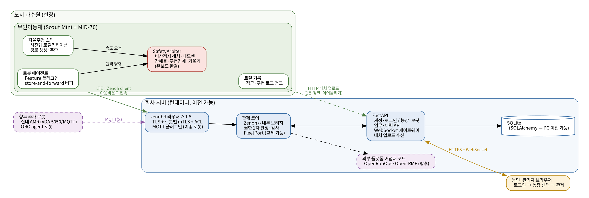
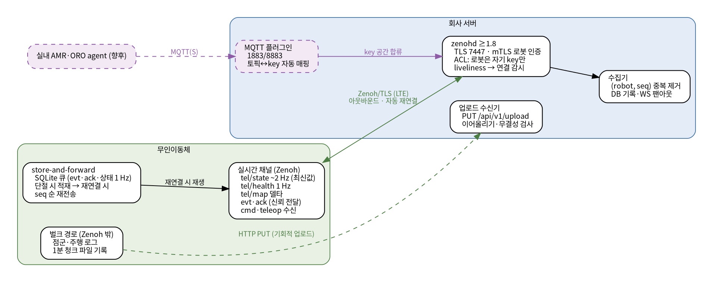
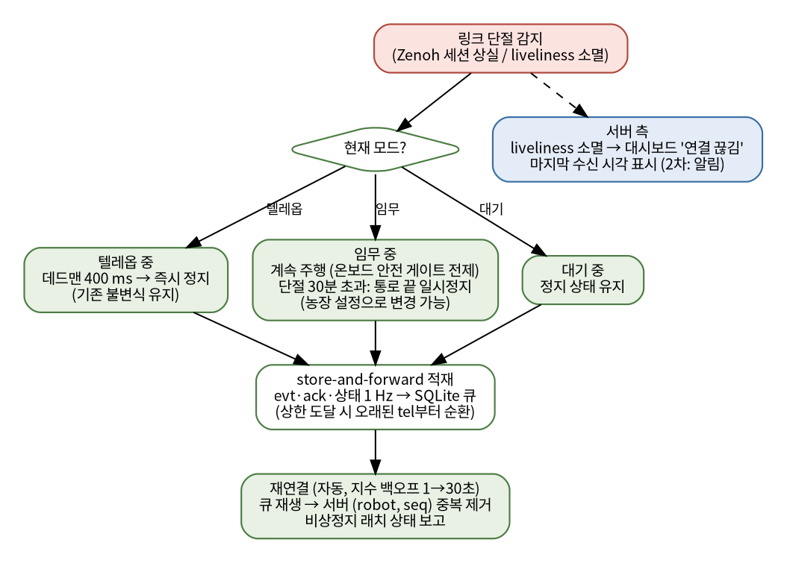
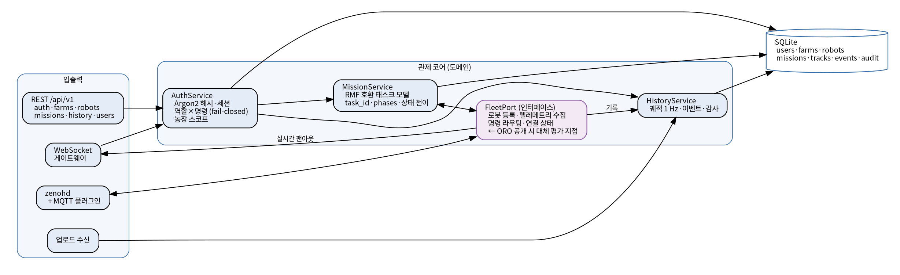
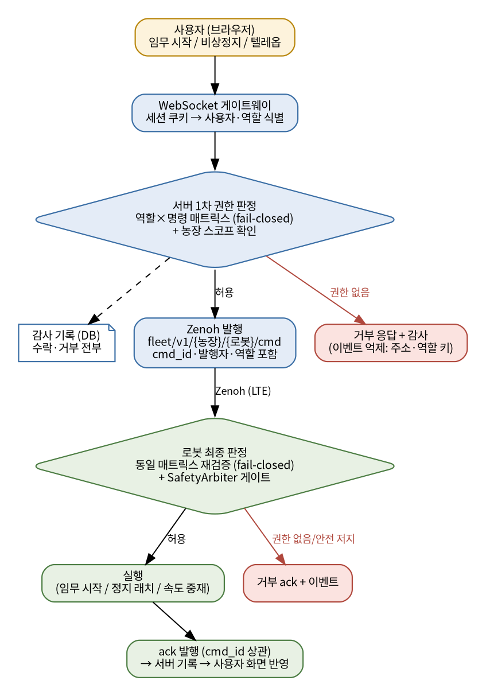
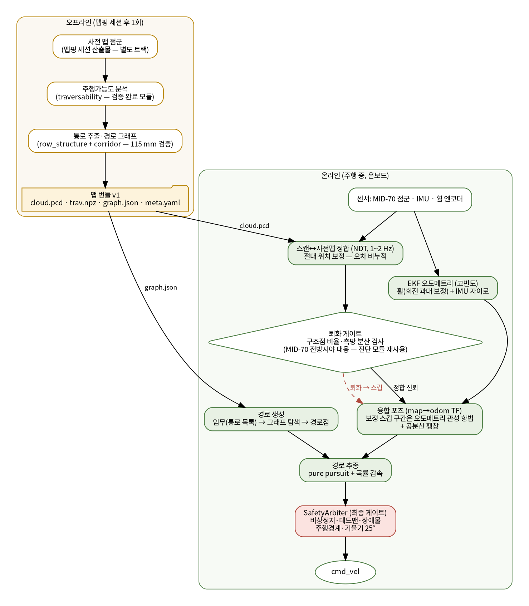
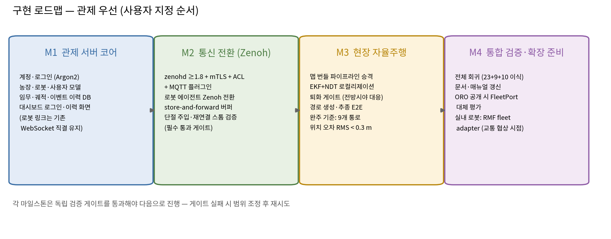

# 노지 과수원 무인이동체 통합관제 — 3계층 시스템 설계서

| 항목 | 내용 |
|---|---|
| 버전 | v1.1 |
| 작성일 | 2026-08-01 |
| 상태 | 적대적 자체 검토 28건 반영 완료 — 사용자 검토 대기 |
| 범위 | 현장(무인이동체) · 통신 · 통합관제 3계층의 1차 상용화 설계 |
| 근거 | 2026-07-31 실사례 리서치 (6에이전트, 교차검증 포함) — 부록 A |

---

## 0. 개요와 목표

### 0.1 배경

노지 과수원(계단식 지형 포함)에서 자율주행하는 무인이동체(AgileX Scout Mini + Livox MID-70 + IMU + 휠 엔코더)를 웹 대시보드에서 통합관제한다. 상용화를 가정하며, 상용 제품(InOrbit, Formant, Burro, Monarch WingspanAI, GUSS, Carbon Robotics)과 산업 표준(VDA 5050, Open-RMF)의 실제 구조를 참고했다.

**센서 제약(고정)**: 추가 센서 없음. MID-70 + IMU + 휠 엔코더만 사용한다 (스타트업 당시 구성과 동일).

**로드맵(사용자 지정)**: 1차는 과수원 로봇 1종. 이후 실내 로봇·타 로봇을 추가해 **이종 로봇을 하나의 관제에서 제어**한다. 이를 위해 OpenRobOps·Open-RMF 호환을 설계에 미리 반영한다.

### 0.2 1차 완성 기준

| 계층 | 완성 기준 |
|---|---|
| 통합관제 | 계정·로그인, 다중 농장 모델, 임무·궤적·이벤트 이력(DB), 실시간 모니터링·임무 지시·비상정지·텔레옵 — 기존 검증 항목(23+9+10) 전부 유지 |
| 통신 | Zenoh(≥1.8) 기반 로봇↔서버 링크가 링크 단절 주입 시험을 통과: 단절 중 이벤트 무손실(§3.3의 보장 경계 내), 자동 재연결, 재생 중복 0, 오프라인 표시 15초 이내 |
| 현장 | **사전 맵이 있다는 가정** 하에: 맵 기반 경로 생성 + 오도메트리 + 로컬리제이션으로 시뮬레이션 9개 통로 임무 완주 (위치 오차 RMS < 0.3 m **그리고** 최대 < 0.7 m) |

사전 맵을 만드는 맵핑 세션 자체(SLAM 표류 문제)는 **별도 연구 트랙**으로 분리한다 (§6.2 참조).

---

## 1. 확정된 결정 사항

| # | 결정 | 내용 | 근거·조건 |
|---|---|---|---|
| D1 | 접근 방식 | A안(진화형): 검증된 기존 자산 위에 상용 요소 증축 | 기존 검증 자산(테스트 42항목) 재사용, 상용 제품 공통 패턴과 동일 구조 |
| D2 | 로봇↔서버 전송 | **Zenoh ≥ 1.8.0** (조건부 채택) | 4G/5G 재연결 버그가 1.8.0(2026-03)에서 수정됨. LTE 프로덕션 선례가 없어 단절 주입 검증을 필수 게이트로 지정 |
| D3 | 브라우저↔서버 | WebSocket 유지 (zenoh-ts 배제) | zenoh-ts는 초기 단계 API. gRPC-Web은 양방향 스트리밍 미지원(2026 현재) |
| D4 | 서버 위치 | 회사 서버 (컨테이너로 이전 가능하게) | 사용자 지정. docker compose 1파일 배포 |
| D5 | 관제 1차 범위 | 계정·로그인 + 데이터 영속화·이력 + 다중 농장 | 사용자 선택. 알림은 2차 |
| D6 | 현장 완성 기준 | 사전 맵 기반 경로 생성·오도메트리·로컬리제이션·자율주행 | 사용자 지정. 상용 과수원 로봇(GUSS)도 사전 맵핑 후 운행 방식 |
| D7 | 이종 로봇 대비 | zenohd MQTT 플러그인(1차에는 **비활성**, 설정만 준비), RMF 호환 임무 모델, FleetPort 교체점 | ORO는 코어 미공개(확인: 2026-08-01), 전송은 MQTT(mosquitto 포크로 확인). RMF는 실내 로봇 추가 시 fleet adapter로 |
| D8 | gRPC의 위치 | 무선 전송으로 쓰지 않음. 향후 외부 시스템 연동 API 계층 후보 | Viam도 WAN은 WebRTC 터널. 셀룰러에서 keepalive·HOL·pub/sub 재구축 부담 |
| D9 | 비상정지 문턱 하향 | estop·stop_all은 **observer 포함 전 역할 허용**. 해제(clear_estop)만 admin | 자체 검토 반영: 화면을 보고 있는 사람이 위험을 목격하면 역할과 무관하게 세울 수 있어야 한다 (비상정지 통념: 가장 낮은 문턱). 기존 구현(operator+)에서 변경 |

---

## 2. 전체 아키텍처

{width=17cm}

### 2.1 설계 원칙

1. **링크 단절은 정상 상태다.** 로봇은 서버 없이 임무를 계속 수행한다(온보드 자율성). 서버는 감독자이지 조종자가 아니다. — Monarch(셀 음영에서 온보드 주행 지속), Naïo와 동일 패턴. 단, 계속 주행은 온보드 안전 게이트(S8·S9)가 활성일 때만 허용된다.
2. **채널 이원화.** 얇은 실시간 채널(텔레메트리 1~5 Hz, 명령)과 대용량 배치 경로(점군·로그, 기회적 업로드)를 분리한다. — Foxglove 실무 가이드의 청크 업로드 패턴
3. **안전은 온보드에서 완결된다.** 물리 E-stop·비상정지 래치·데드맨·장애물 정지·주행경계·기울기 정지는 전부 로봇 안에서 판정한다. 서버·링크는 안전 경로에 없다.
4. **서버가 손상돼도 로봇의 온보드 안전 불변식(§7)은 우회할 수 없다.** 서버는 명령 발행 주체로서 신뢰 경계 안에 있다 — 즉 손상된 서버는 유효한 명령(임무 지시 등)을 보낼 수 있으나, S0~S4·S8~S10을 무력화할 수는 없다. 명령의 종단 간 서명(사용자 키 기반)은 확장 경로로 남긴다.
5. **임무 모델은 처음부터 호환 형태로.** task_id·phases·상태 전이는 Open-RMF 태스크 모델, 연결 감시·order/state 의미론은 VDA 5050을 따른다.

### 2.2 시스템 경계

| 시스템 | 배포 단위 | 책임 | 의존 |
|---|---|---|---|
| 현장(로봇) | 로봇 온보드 PC | 자율주행·안전·센서·로컬 기록 | 통신 계층의 토픽 계약만 |
| 통신 | 양쪽 라이브러리 + zenohd | 토픽 계약(스키마)·전송·재연결·버퍼 | 없음 (계약이 기준) |
| 관제 | 회사 서버 컨테이너 | 계정·이력·감독 UI·다중 농장 | 통신 계층의 토픽 계약만 |

**토픽 계약이 세 시스템의 유일한 접점이다.** 계약만 지키면 현장 파트는 시뮬이든 실기든 무관하고, 관제는 로봇 수·종류와 무관하다. 계약은 `contracts/` 디렉토리의 JSON Schema로 명세하고 양쪽 CI에서 검증한다.

---

## 3. 통신 계층

{width=17cm}

### 3.1 토폴로지

- **서버**: zenohd(≥1.8) 컨테이너. TLS 수신(tcp/tls:7447) + ACL. MQTT 플러그인은 1차에는 **비활성**(설정 파일만 준비 — D7)
- **로봇**: Zenoh client 모드로 서버에 **아웃바운드** 접속(LTE·NAT 통과). 자동 재연결(지수 백오프 1→30 s)
- **연결 감시 시간 상수(계약 수준)**: 세션 lease 10 s — LTE half-open 연결에서도 서버가 15초 이내에 오프라인을 감지·표시한다 (VDA 5050이 connection 토픽에 명시적 타임아웃을 두는 것과 같은 이유)
- **브라우저**: 서버의 WebSocket 게이트웨이 경유 (Zenoh에 직접 접속하지 않음)

### 3.2 Key 공간 (토픽 계약 v1)

기존 `orchard/{robot}/...` 체계를 농장 스코프·버전을 넣어 승계한다. MQTT 토픽은 동일 문자열로 매핑된다(플러그인 활성 시).

| Key | 방향 | 빈도 | 전달 보장 | 내용 |
|---|---|---|---|---|
| `fleet/v1/{farm}/{robot}/tel/state` | 로봇→ | ~2 Hz | BestEffort·최신값 | 포즈·모드·비상정지·임무 진행 |
| `fleet/v1/{farm}/{robot}/tel/health` | 로봇→ | 1 Hz | BestEffort | 센서 Hz·CPU·배터리·경고 |
| `fleet/v1/{farm}/{robot}/tel/map` | 로봇→ | 키프레임 30 s + 델타 0.5 Hz | BestEffort | 장애물 격자. 델타는 기준 `keyframe_id`를 포함 — 서버는 불일치 델타를 폐기하고 다음 키프레임에서 재동기화 |
| `fleet/v1/{farm}/{robot}/evt` | 로봇→ | 사건 시 | **Reliable + S&F** | 임무 전이·거부·안전 이벤트 |
| `fleet/v1/{farm}/{robot}/ack` | 로봇→ | 명령 응답 | **Reliable + S&F** | cmd_id 상관 응답 |
| `fleet/v1/{farm}/{robot}/cmd` | →로봇 | 명령 시 | Reliable | estop·clear_estop·stop_all(팬아웃)·mission_*·set_mode |
| `fleet/v1/{farm}/{robot}/cmd/teleop` | →로봇 | 20 Hz | BestEffort·최신값 | 속도 지령 (데드맨 400 ms) |
| liveliness `fleet/v1/{farm}/{robot}/alive` | 로봇 선언 | — | Zenoh liveliness | 연결 감시 |

- 봉투(envelope)는 기존 v1을 유지한다: `{v, topic, ts_ns, seq, payload}`
- **seq는 채널별 단조 증가**다 (로봇 전역이 아님). 중복 제거 키는 `(robot, channel, seq)`
- `cmd`에는 `cmd_id`(응답 상관), 발행 사용자·역할, **`expires_at`**을 추가한다. 로봇은 만료된 명령을 거부하고 감사 이벤트를 남긴다
- **오프라인 로봇에게 보낸 명령은 즉시 실패 응답한다** (서버측 명령 큐 없음 — 수 시간 뒤 낡은 명령이 실행되는 지연 명령 위험 차단)

### 3.3 store-and-forward (로봇측)

- 대상: `evt`·`ack` 전부 + `tel/state` 1 Hz 다운샘플
- 저장: 로봇 SQLite 큐. 단절 중 적재, 재연결 시 seq 순 재전송
- 서버는 `(robot, channel, seq)`로 중복 제거하며, 이 키는 DB에 저장된다(§4.3) — 서버 재시작 직후의 재전송도 중복 삽입되지 않는다
- **보장 경계(수치)**: `evt`·`ack`는 **단절 24시간 또는 큐 256 MB까지 무손실 보장**. 초과 시 오래된 `evt`부터 폐기하되, 폐기 사실 자체를 요약 `evt`로 남긴다. `tel` 다운샘플은 상한 도달 시 먼저 순환 폐기된다
- 근거: 브로커측 보관은 신뢰할 상한이 아니다 — AWS IoT Core는 기본 1시간(설정 최대 7일), mosquitto는 설정 의존. 디바이스측 버퍼가 실무 정석

### 3.4 링크 단절 정책

{width=13cm}

| 모드 | 단절 시 동작 | 비고 |
|---|---|---|
| 텔레옵 | 데드맨 400 ms → 즉시 정지 | 기존 불변식 유지 |
| 임무 | **계속 주행** (기본) — 단 온보드 안전 게이트(S8 장애물·S9 주행경계)가 활성일 때만. **단절 30분 초과 시 현재 통로 완료 후 일시정지** | 농장 설정(`farms.config_json`)으로 정책 변경 가능: 즉시 통로 끝 일시정지 / 무제한 계속. 기존 LINK_LOSS_STOP(1500 ms 정지)을 대체 |
| 대기 | 정지 유지 | — |

비상정지 래치는 로컬에서 유지되고, 재연결 시 상태를 보고한다. 서버는 liveliness 소멸(≤15 s)로 "연결 끊김"을 표시한다. 단절 중 원격 estop이 불가능한 구간이 존재하므로, 그 구간의 안전은 온보드 불변식(S0, S8~S10)이 담당한다 — 이것이 §7이 소프트웨어 원격 제어와 독립적으로 구성되는 이유다.

### 3.5 벌크 경로 (Zenoh 밖)

- 점군·주행 로그는 로봇에서 **1분 단위 청크 파일**로 기록
- 링크 여유 시 기회적 업로드. 실시간 채널과 대역 경쟁하지 않도록 업로드 대역 상한 설정
- **이어올리기 프로토콜**: ① `GET /api/v1/upload/{robot}/{name}/offset`으로 서버 보유 오프셋 조회 → ② `PUT` + `Content-Range`로 나머지 범위 전송 → ③ 서버가 전체 해시 검증 후 완료 응답 (불일치 시 폐기·재요청)

### 3.6 보안

| 구간 | 방식 |
|---|---|
| 로봇↔zenohd | TLS + **로봇별 mTLS 클라이언트 인증서**(CN=robot_id) |
| zenohd ACL | 로봇은 `fleet/v1/{farm}/{자기 id}/**`만 pub/sub 가능. `cmd`는 서버만 발행 가능 |
| 로봇 인증서 수명주기 | 자체 CA(오프라인 보관) → 로봇 프로비저닝 시 발급·설치 → 만료 전 갱신 절차 → 폐기는 CRL 갱신 + zenohd 재적재. 절차는 운영 문서로 M2에 작성 |
| MQTT 구간 (향후) | 1차 비활성. 활성화 시 **8883(TLS) 전용**, 클라이언트 계정·토픽 제한(ACL)을 별도 규정 — 평문 1883은 열지 않는다 |
| 사용자↔서버 | HTTPS + 세션 쿠키(HttpOnly, **SameSite=Strict**). 로봇 인증과 완전 분리 |
| WebSocket | 핸드셰이크 시 **Origin 허용 목록 검증** (Cross-Site WebSocket Hijacking 차단) |
| REST 상태 변경 | CSRF 토큰 요구 (POST·PATCH·DELETE 전부) |
| 업로드 수신 | 사용자 트래픽과 **별도 포트**에서 로봇 클라이언트 인증서 필수로 수신 (TLS 종단·검증 지점을 명확화) |
| 감사 | 명령 수락·거부 전부 DB 기록 (§4.5). 텔레옵은 세션 단위 기록. 토큰·비밀 마스킹 유지 |

### 3.7 검증 게이트 (M2 필수 통과)

Zenoh의 LTE 프로덕션 선례가 없으므로 자체 검증한다: ① 단절 주입(라우터 강제 종료, tc netem 지연·유실) 중 `evt` 무손실(§3.3 경계 내), ② 재연결 스톰(반복 단절) 후 정상 복귀, ③ 서버 재시작 포함 재생 시 중복 0, ④ teleop 데드맨이 단절 시 400 ms 내 정지, ⑤ 단절 후 15 s 내 대시보드 오프라인 표시.

---

## 4. 관제 서버

{width=17cm}

### 4.1 기술 스택

FastAPI + SQLAlchemy + SQLite(파일 DB, 볼륨 마운트 — PostgreSQL 이전 호환 스키마) + zenoh-python 브리지. docker compose 배포: `zenohd` + `server` + (업로드 mTLS 종단용 리버스 프록시 1개 — §3.6).

### 4.2 FleetPort — 이종 로봇·플랫폼 교체점

로봇 등록·텔레메트리 수집·명령 라우팅·연결 상태를 인터페이스로 추상화한다.

```
FleetPort
  register_robot(robot_id, farm_id, conn_kind)   # zenoh | mqtt
  on_telemetry(robot_id, channel, payload)        # 수집 콜백
  send_command(robot_id, cmd_id, payload) -> ack  # 명령 라우팅 (오프라인 → 즉시 실패)
  robot_status(robot_id) -> {online, last_seen}
```

- 연결 감시는 conn_kind별 구현이 다르다: **zenoh = liveliness 구독**, **mqtt = LWT 메시지 + keepalive 타임아웃** (MQTT 클라이언트는 Zenoh liveliness 토큰을 선언할 수 없다)
- 1차 구현: Zenoh 브리지만. MQTT 구현은 플러그인 활성화 시점(이종 로봇 추가)에
- **OpenRobOps 코어가 공개되면 이 계층만 대체 평가한다** (과수원 특화 계층·Zenoh 링크는 유지)
- Open-RMF는 실내 로봇 추가로 교통 협상이 필요해지는 시점에 fleet adapter로 연동

### 4.3 데이터 모델 (SQLite)

| 테이블 | 주요 컬럼 | 용도 |
|---|---|---|
| users | id, login(유일), pw_hash(Argon2), role, disabled | 계정. **1차에서 역할은 전역**(농장별 역할은 user_farms.role 컬럼 추가로 확장 — 스키마 노트로 예약) |
| user_farms | user_id, farm_id | 사용자↔농장 스코프 |
| farms | id, name, map_bundle_ref, **config_json** | 농장(사이트). config_json에 링크 단절 정책 등 |
| robots | id, farm_id, name, kind, conn_kind, last_seen, config_json | 로봇 등록 |
| missions | id, robot_id, farm_id, spec_json(**map_bundle 해시 포함**), state, phases_json, created_by, started_at, ended_at | RMF 호환 태스크 |
| mission_events | mission_id, ts, **channel, seq**, kind, payload_json | 임무 전이 이력 |
| tracks | robot_id, ts, x, y, yaw, mode | 주행 궤적 1 Hz |
| events | robot_id, ts, **channel, seq**, kind, severity, msg, payload_json — 유니크 (robot_id, channel, seq) | 이벤트 (중복 제거 영속화) |
| audit | ts, user_id, role, action, target, result, detail | 감사 (거부 포함 전부. 텔레옵은 세션 단위) |

**임무 상태기계** (estop 상호작용 포함):

| 현재 상태 | 이벤트 | 다음 상태 |
|---|---|---|
| QUEUED | 시작 | RUNNING |
| QUEUED | 취소 | CANCELED |
| RUNNING | 일시정지 / **estop 발동** | PAUSED |
| RUNNING | 완료 / 취소 / 오류 | DONE / CANCELED / FAILED |
| PAUSED | 재개(mission_resume, operator+) | RUNNING |
| PAUSED | 취소 / 오류 | CANCELED / FAILED |

**clear_estop은 래치만 해제한다 — 임무는 PAUSED에 머물고, 재개는 별도 mission_resume으로만** (해제 버튼이 로봇을 출발시키는 안전 서프라이즈 차단). VDA 5050 order/state 의미론과 상호 변환 가능하게 유지한다.

### 4.4 REST API (/api/v1) + WebSocket

| 경로 | 권한 | 내용 |
|---|---|---|
| POST /auth/login, /auth/logout, GET /auth/me | 공개/세션 | 로그인·세션 |
| GET /farms, /robots, /robots/{id}/status | **observer+** (user_farms 스코프 필터) | 조회 |
| POST·PATCH /farms, /robots, /users | admin | 등록·관리 |
| POST /missions, POST /missions/{id}/(pause·resume·cancel) | operator+ | 임무 지시 |
| GET /missions, /tracks?robot&from&to, /events | observer+ (스코프 필터) | 이력 조회 |
| GET /audit | admin | 감사 조회 |
| PUT /upload/{robot}/{name} (+ /offset) | 로봇 mTLS (별도 포트) | 벌크 수신 (§3.5) |
| WS /ws | 세션 쿠키 + Origin 검증 | 실시간 구독(농장 스코프)·명령 |

### 4.5 명령 흐름과 권한

{width=12cm}

역할 매트릭스(fail-closed 로직 승계 — 미지 명령은 admin, 미지 역할은 observer로):

| 명령 | observer | operator | admin |
|---|---|---|---|
| 조회·모니터링 | ○ | ○ | ○ |
| **비상정지 (estop)** | **○** | ○ | ○ |
| **전체 정지 (stop_all)** | **○** | ○ | ○ |
| 임무 시작·일시정지·재개·취소 | × | ○ | ○ |
| 텔레옵 | × | ○ | ○ |
| 비상정지 해제 (clear_estop) | × | × | ○ |
| 모드 변경·계정·농장 관리 | × | × | ○ |

- estop·stop_all의 observer 허용은 D9 결정 (세우는 건 누구나, 푸는 건 admin만)
- **stop_all 의미론**: 사용자 스코프 내 전 로봇에 로봇별 estop 팬아웃. 로봇별 ack를 개별 추적하고, 미달 로봇은 화면에 "정지 미확인"으로 표시 + 자동 재시도 (부분 실패를 숨기지 않는다)
- 거부 이벤트 억제는 (주소, 역할) 키·160자 절단·건수 상한 유지 (감사 DB에는 전부 기록, 텔레옵은 세션 단위)

---

## 5. 웹 대시보드

- **유지**: 단일 파일·외부 의존성 0 원칙, 현재 기능 전부 (다중 로봇 탭, 캔버스 지도, 비상정지+래치, 임무, 텔레옵+데드맨, 상태, 기능 기반 패널, 전체 정지)
- **추가 화면**:

| 화면 | 내용 | 권한 |
|---|---|---|
| 로그인 | 아이디/비밀번호 → 세션 쿠키. 실패 시 지연 응답 | 공개 |
| 농장 선택 | 사용자 스코프 내 농장 목록(GET /farms) → 선택 시 해당 농장 로봇 탭 로드 | observer+ |
| 이력 | 임무 목록 → 선택 시 궤적을 지도에 재생, 이벤트 타임라인 | observer+ |
| 사용자 관리 | 계정 생성·역할 부여·비활성화 | admin |

- WebSocket 인증을 기존 `?token=` 쿼리에서 **세션 쿠키 + Origin 검증**으로 교체 (로봇용 인증과 분리, §3.6)
- 전체 정지 버튼은 stop_all 의미론(§4.5)을 따른다 — 로봇별 확인·미확인 표시 포함

---

## 6. 현장 시스템 (무인이동체)

{width=15cm}

### 6.1 맵 번들 (오프라인 산출물)

맵핑 세션 산출 점군에서 오프라인 파이프라인(기존 검증 모듈 승격: traversability → row_structure → corridor, 센서 점군 기준 115 mm 정확도 검증 완료)으로 생성:

| 파일 | 내용 |
|---|---|
| cloud.pcd | 다운샘플 점군 (로컬리제이션 기준 맵) |
| trav.npz | 주행가능도 격자 (모름≠장애물 3상 처리 포함) — **런타임 주행경계(S9)의 기준** |
| graph.json | 통로 중심선·경로 그래프 |
| meta.yaml | 원점·해상도·**버전 해시**·생성 이력 |

**배포와 버전 정합**: 번들은 서버에 등록되고(농장 모델 `map_bundle_ref`), 로봇은 서버에서 다운로드한다(M3 범위). 임무 spec에는 번들 버전 해시가 포함되며, **로봇은 자기 번들과 해시가 다르면 임무를 거부하고 evt를 발행한다** — 서버가 v2 그래프로 만든 임무를 로봇이 v1 지형에서 실행하는 사고를 계약 수준에서 차단.

### 6.2 로컬리제이션 — 왜 이 구조가 기존 문제를 피하는가

기존 실패: 주행 중 맵을 만드는 LIO(SLAM)는 MID-70 전방시야(±35.2°) 탓에 선회부에서 측방·요 제약이 소실되어 오차가 **누적**됐다 (8가지 대책 시도, 재현 확인). 사전 맵 기반 로컬리제이션은 맵이 절대 기준을 제공하므로 **오차가 누적되지 않는다** — 퇴화 구간은 잠시 오도메트리로 버티고, 구조물이 보이면 재정착한다.

- **EKF 오도메트리(고빈도)**: 휠 엔코더(스키드 스티어 회전 과대 보정 계수 적용) + IMU 자이로 — 측정 완료: 순수 휠은 회전 +219% 과대, 자이로 통합 요는 0.08° 수준
- **스캔↔사전맵 정합(1~2 Hz)**: NDT 정합으로 절대 위치 보정
- **퇴화 게이트**: 구조점 비율·측방 분산 검사 (기존 진단 모듈 재사용, 임계값은 측정 데이터로 캘리브레이션). 퇴화 시 보정 스킵 + 공분산 팽창 → 오도메트리 관성 항법
- **관성 항법 상한(S10)**: 보정 스킵 연속 시간 > T_loc **또는** 위치 공분산 > C_loc이면 **정지 + evt 발행**. T_loc·C_loc은 M3 로컬리제이션 시험에서 캘리브레이션 (상한 없는 추측항법 금지 — 휠 오도메트리 특성상 맹목 주행은 주행경계 이탈로 직결)
- **초기 위치**: 대시보드에서 지정 또는 지정 주차 지점에서 기동
- SLAM(맵핑 세션 생성) 자체는 별도 연구 트랙: 루프 클로저 포즈 그래프 또는 열구조 제약 — 오프라인 처리 허용이므로 온라인 LIO보다 조건이 유리하다

### 6.3 경로 생성·추종·주행 안전

- 경로 생성: 임무(통로 목록) → graph.json 탐색 → boustrophedon 순서 경로점 열
- 추종: pure pursuit + 곡률 감속 프로파일
- **장애물 정지(S8)**: 전방 정지 영역(로봇 폭 + 여유 × 제동 거리) 안에 지면 위 점군 군집이 감지되면 정지. 사라지면 재개(임무 모드), 지속되면 evt 발행. `tel/map`에 쓰는 장애물 격자와 같은 소스를 주행 정지에도 사용한다
- **선회 사각 정책**: MID-70은 전방 ±35.2°뿐이므로 선회 중 측방은 사각이다. 선회 구간은 (a) 속도 상한 하향, (b) 선회 진입 전 정지 후 회전 스캔(농장 설정 선택)으로 대응
- **주행경계(S9)**: trav.npz 주행가능 영역(+안전 여유 폭) 밖으로 향하는 속도 지령을 SafetyArbiter가 차단. 전방 지면 소실(음의 장애물 — 법면 가장자리) 감지 시 정지
- **저배터리 2단계**: 경고 임계(25%)에서 evt 발행, 정지 임계(10%)에서 임무 중단 + 현재 통로 완료 후 정지 (통로 한가운데 방전 회수 작업 방지)
- 속도 중재: VelocityRequest 우선순위(텔레옵 10 > 임무 5) → SafetyArbiter 최종 게이트 (기존 구조 유지)

### 6.4 로봇 에이전트

기존 플러그인 호스트(Feature, requires/optional_requires, 위상 정렬 로드, 3-strike 격리)를 유지하고 전송부만 Zenoh client로 교체한다. store-and-forward 버퍼가 에이전트에 추가된다.

---

## 7. 안전 불변식 (전 계층)

원격 조작 안전(S1·S2·S5·S7)만이 아니라 **자율주행 자체의 위험(충돌·낙하·위치 상실)** 을 온보드 불변식으로 커버한다 — 링크 단절 중 원격 개입이 불가능한 구간이 정상 운용에 포함되기 때문이다(§3.4).

| # | 불변식 | 판정 위치 |
|---|---|---|
| S0 | **물리 E-stop**(Scout Mini 하드웨어 버튼)이 최상위다 — 소프트웨어와 무관하게 구동 전원을 차단하며, 본 설계의 어떤 계층도 이를 대체하지 않는다 | 하드웨어 |
| S1 | 소프트웨어 비상정지는 래치된다. 해제는 admin의 명시적 clear_estop뿐. 해제는 래치만 풀며 **임무 자동 재개 없음**(재개는 별도 mission_resume) | 로봇 |
| S2 | 텔레옵 데드맨 400 ms — 초과 시 정지 | 로봇 |
| S3 | 기울기 **정지 25° / 경고 20°** (Scout Mini 공칭 등판 30° 대비 보호 여유 확보. 기존 35°에서 하향) | 로봇 |
| S4 | 안전 기능은 플러그인이 아니다 — 코어에 고정, 비활성화 불가 | 로봇 |
| S5 | 권한 판정은 fail-closed — 미지 명령→admin 요구, 미지 역할→observer 강등, 빈 인증 설정→전면 잠금, **만료(expires_at 경과) 명령→거부** | 서버+로봇 |
| S6 | 서버·링크 장애는 로봇을 위험하게 만들 수 없다 (§3.4 정책, S8~S10 전제) | 로봇 |
| S7 | 모든 명령 수락·거부는 감사에 남는다 (텔레옵은 세션 시작·종료·거부 단위 — 20 Hz 개별 지령은 제외). 억제는 화면 이벤트만 | 서버 |
| S8 | **장애물 정지** — 전방 정지 영역 내 점군 장애물 감지 시 정지 (SafetyArbiter 코어, §6.3) | 로봇 |
| S9 | **주행경계** — 주행가능 영역(+여유 폭) 밖으로 향하는 속도 지령 차단, 전방 지면 소실 감지 시 정지 (계단식 법면 낙하 방지) | 로봇 |
| S10 | **로컬리제이션 상실 상한** — 보정 스킵 연속 T_loc 초과 또는 공분산 C_loc 초과 시 정지 + evt (맹목 주행 금지) | 로봇 |

---

## 8. 테스트·검증 계획

| 종류 | 내용 | 합격 기준 |
|---|---|---|
| 계약 | contracts/ JSON Schema로 양측 메시지 검증 (CI) | 스키마 위반 0 |
| 서버 단위 | 로그인·세션·역할, 임무 상태기계(estop→PAUSED 포함), 이력 API | 전 항목 통과 |
| 링크 | 단절 주입·재연결 스톰·서버 재시작 포함 재생 무결성·오프라인 표시 시간 (§3.7) | evt 무손실(경계 내)·중복 0·데드맨 400 ms·오프라인 표시 ≤15 s |
| 보안 | 기존 21(9항목)·30(10항목) 이식 + 세션 만료 + mTLS 위조 거부 + **교차 농장 인가(타 농장 로봇 명령 → 거부)** + **CSRF/Origin (교차 출처 WS·POST 차단)** | 전 항목 통과 |
| E2E | 시뮬 로봇+서버+브라우저: 임무 완주·비상정지 왕복(estop→PAUSED→clear→resume)·stop_all 부분 실패 표시·이력 기록 | 기존 17(23항목) 이식 확장 |
| 로컬리제이션 | 참값 대비 궤적 오차 (9개 통로 임무) + T_loc·C_loc 캘리브레이션 | RMS < 0.3 m 그리고 최대 < 0.7 m |
| 주행 안전 | 장애물 투입 정지(S8)·주행경계 이탈 차단(S9)·퇴화 지속 정지(S10)·저배터리 2단계 | 전 항목 통과 |
| 마이그레이션 | SQLite 스키마 버전업 (Alembic) | 왕복 무손실 |

측정 규율(기존 교훈 유지): 지표는 참값 데이터로 먼저 검증하고, 단일 수치가 아니라 구간별 분해로 본다.

---

## 9. 구현 로드맵

{width=17cm}

| 마일스톤 | 내용 | 게이트 |
|---|---|---|
| M1 관제 서버 코어 | 계정·DB·이력·다중 농장 + 대시보드 로그인·이력 화면. 로봇 링크는 **레거시 WS 어댑터**(한시 — 기존 봉투·토큰 수용, 서버 감사로 기록, M2에서 제거)로 유지 | 서버 단위 + 보안 + E2E(기존 이식) |
| M2 통신 전환 | zenohd(mTLS, ACL, lease 10 s), 로봇 에이전트 Zenoh화, store-and-forward, CA 운영 절차 문서 | §3.7 링크 검증 전부 |
| M3 현장 자율주행 | 맵 번들 파이프라인·배포 API, EKF+NDT 로컬리제이션, 퇴화 게이트+S10, S8·S9 주행 안전, 경로 생성·추종 | 9개 통로 완주 + 주행 안전 시험 전부 |
| M4 통합 검증·확장 준비 | 전 회귀, 문서·매뉴얼, ORO 재평가 게이트 | 전 테스트 녹색 |

각 마일스톤은 게이트를 통과해야 다음으로 진행한다. M1이 최우선이다 (사용자 지정: 관제부터).

---

## 10. 확장 경로 (1차 범위 밖, 자리만 확보)

| 항목 | 트리거 | 준비된 이음새 |
|---|---|---|
| OpenRobOps 도입 | 코어 공개 (2026 중 예정, 현재 미공개 확인) | FleetPort 대체 평가. ORO 전송은 MQTT — 플러그인 활성화로 수용 |
| Open-RMF 연동 | 실내 로봇 추가·교통 협상 필요 시점 | RMF 호환 임무 모델 → fleet adapter는 얇은 번역기 |
| 농장별 역할 | 운영 요구 발생 시 | user_farms.role 컬럼 (스키마 예약) |
| 명령 종단 간 서명 | 보안 요구 상향 시 | cmd 봉투에 서명 필드 여지 (§2.1 원칙 4) |
| 이벤트 알림 | 2차 | events 테이블 + 알림 발송기 추가만 |
| 클라우드 이전 | 원격 접속 수요 | 컨테이너 그대로 이전, zenohd 주소만 변경 |
| 하이브리드 (현장 엣지) | 농장 수·대역 요구 증가 | zenohd 라우터 체인 (Zenoh 자연 지원) |
| 텔레옵 저지연화 | LTE 왕복 지연이 문제 될 때 | WebRTC 채널 분리 (Formant 패턴) |

---

## 부록 A. 리서치 근거 요약 (2026-07-31, 6에이전트 교차검증)

- **Zenoh**: ROS 2 Kilted Tier 1 승격 (2025-05, 공식) — 단 Jazzy에는 미적용. 4G/5G 재연결 버그 1.8.0(2026-03-18) 수정 (공식 릴리스 노트). IAC 무선 프로덕션 운용. LTE WAN 프로덕션 공개 사례 없음 → 자체 검증 게이트 지정
- **gRPC**: Viam은 WAN을 WebRTC로 터널 (공식 문서). Rocos는 pub/sub·keepalive 자체 구현. gRPC-Web 양방향 스트리밍 미지원 유효 (로드맵 2025-06 갱신 확인). keepalive 미설정 시 15~20분 무감지 (grpc#32435)
- **상용 농업 로봇**: 6개사 전수 — gRPC/Zenoh 공개 채택 0건. 공통 패턴: 셀룰러/위성 + 클라우드 + REST/독자 API + 온보드 자율성 + 채널 분리 (Carbon: Starlink+ROCC는 AutoTractor 번들, LaserWeeder 정비는 Remote.It VPN — 채널 분리의 실례. Monarch: Verizon LTE+AWS, GUSS: 현장 트럭 감독, Deere: LTE+Starlink 병행)
- **플릿 표준**: VDA 5050 = MQTT 명시 규정 + 연결 감시 타임아웃. Open-RMF = WebSocket/REST. Transitive = MQTTSync. AWS = IoT Greengrass(MQTT). InOrbit agent 전송 비공개(문서), OpenRobOps는 GitHub 조직에 sim-flatland·mosquitto 포크만 공개 (2026-08-01 직접 확인) — 코어·에이전트 미공개, ORO 전송=MQTT 신호
- **노지 무선**: 농장 4G 부적합 실측 (Machines 2023). 미국 농지 30% 미커버 → Deere LTE+Starlink (2024). 브로커측 보관은 신뢰할 상한이 아님 (AWS IoT 기본 1시간·최대 7일) → 디바이스측 버퍼 정석. 대용량은 1분 청크 배치 업로드 (Foxglove)

## 부록 B. 기존 검증 자산 (재사용 대상)

| 자산 | 상태 |
|---|---|
| 통로 추출 파이프라인 (traversability·row_structure·corridor) | 센서 점군 기준 115 mm, 9/9 통로, 교차 0 검증 |
| 로봇 에이전트 플러그인 구조 (Feature·Registry·SafetyArbiter) | 실행 검증 23/23 |
| 역할 인증·감사 (fail-closed, 억제 키, 마스킹) | 실행 검증 9/9 + 10/10 |
| 웹 대시보드 (27 KB 단일 파일) | 실환경 23/23 |
| 휠·IMU 특성 측정 (회전 +219%, 자이로 요 0.08°) | 캘리브레이션 근거 확보 |
| 퇴화 진단 (구조점 비율·측방 분산) | 게이트 임계값 근거 확보 |

## 부록 C. 변경 이력

| 버전 | 내용 |
|---|---|
| v1.0 | 초안 (섹션 1 아키텍처는 대화에서 승인, OpenRobOps 현황 검증 반영) |
| v1.1 | 적대적 자체 검토 28건(상 5·중 14·하 9) 전부 반영 — 주행 안전 불변식 S0·S8·S9·S10 신설, 원칙 4 정직화, estop 문턱 하향(D9), seq/중복제거/키프레임/만료 명령/S&F 경계 수치화, WS Origin·CSRF, MQTT 플러그인 1차 비활성, 맵 번들 버전 정합, estop→임무 PAUSED, 기울기 25°, 저배터리 2단계, 레거시 WS 어댑터 명시 등 |
